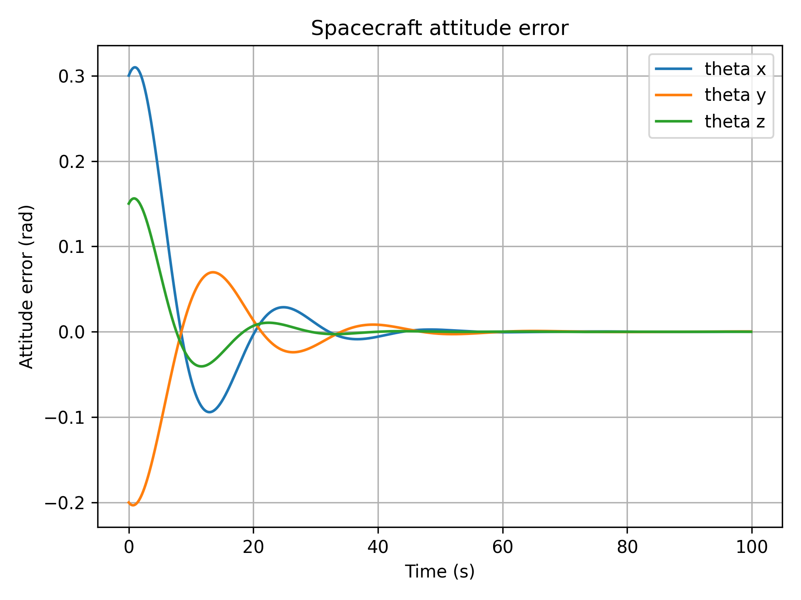
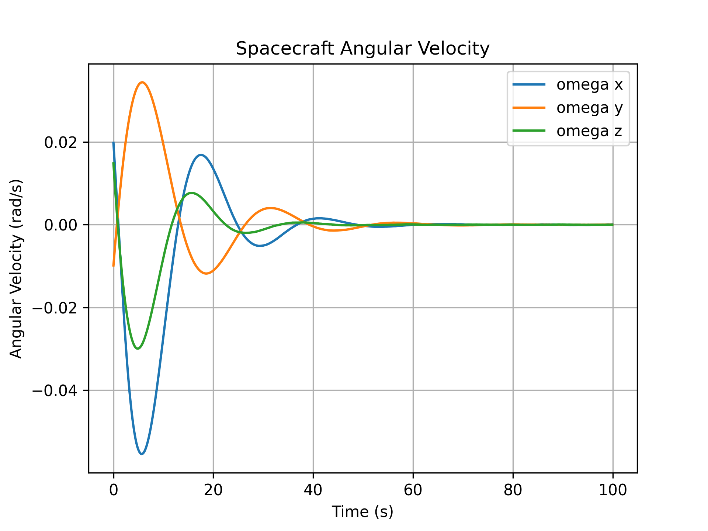
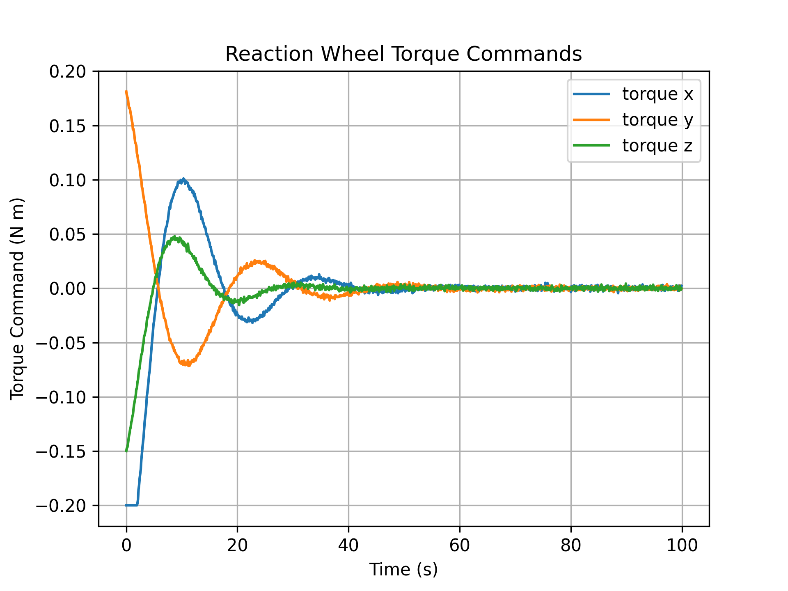
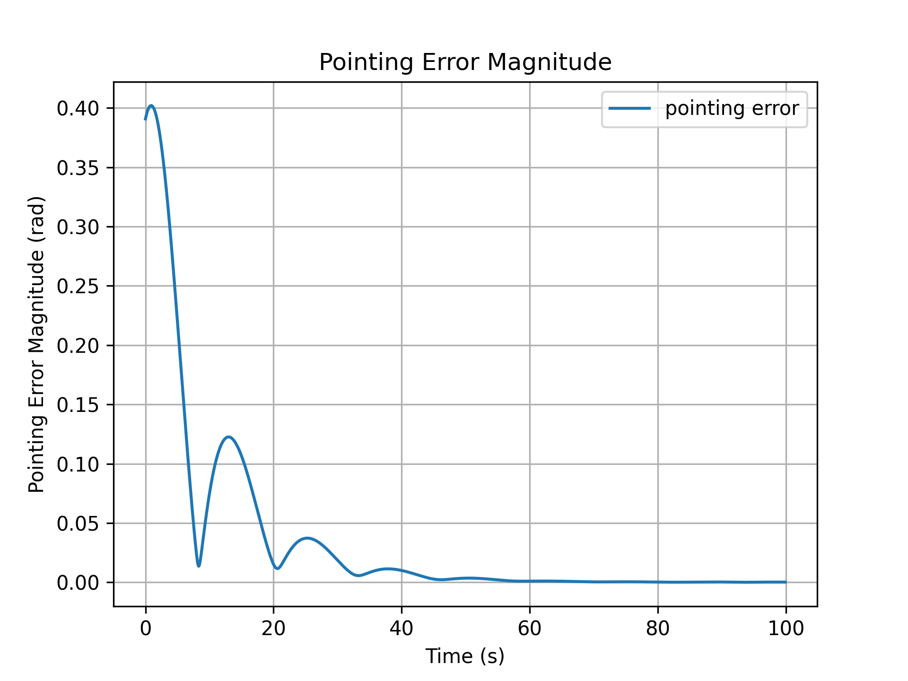

# Spacecraft Attitude HWIL Simulation

This project simulates a spacecraft attitude control system using a hardware-in-the-loop style architecture. The system separates spacecraft dynamics, sensor measurements, actuator commands, scheduled flight software tasks, and telemetry output.

The spacecraft is modeled in Python. The flight software controller is implemented in C. The Python simulation sends sensor-like data to the compiled C controller, receives actuator torque commands, applies actuator limits, and updates the spacecraft attitude state.

## Project Motivation

Spacecraft flight software must operate with noisy sensor data, actuator limits, scheduled control loops, and telemetry constraints. This project models those ideas in a simplified attitude control problem.

The goal is not to model a full spacecraft. The goal is to demonstrate the structure of a GN&C and avionics software workflow.

## Features

- 3-axis spacecraft attitude stabilization model
- C-based flight software attitude controller
- HWIL-style separation between plant dynamics and controller logic
- Sensor noise model
- Reaction wheel torque saturation
- RTOS-style task scheduling
- Health-monitor telemetry
- CSV telemetry output
- Python result plotting

## System Architecture

The system has two main parts:

1. Python spacecraft simulation
2. C flight software controller

The Python simulation models the spacecraft state, sensor noise, actuator limits, and telemetry logging.

The C controller receives a sensor packet containing attitude error and angular velocity. It computes reaction wheel torque commands using a proportional-derivative control law.

## Documentation

Additional design notes are included in:

- `docs/system_architecture.md`
- `docs/control_design.md`
- `docs/results.md`

## Data Flow

```text
True spacecraft state
        |
        v
Noisy sensor model
        |
        v
C flight software controller
        |
        v
Reaction wheel torque command
        |
        v
Actuator saturation model
        |
        v
Spacecraft dynamics update
        |
        v
Telemetry CSV and plots
```

## RTOS-Style Task Rates

| Task | Rate | Period |
|---|---:|---:|
| Sensor task | 100 Hz | 0.01 s |
| Control task | 50 Hz | 0.02 s |
| Telemetry task | 10 Hz | 0.10 s |
| Health task | 1 Hz | 1.00 s |

The plant dynamics are integrated at 0.01 s. Telemetry is logged separately at 10 Hz.

## Results

The controller stabilizes the initial attitude error and damps angular velocity toward zero. The simulation also records torque saturation events and pointing error magnitude.

Example output:

```text
Final pointing error: 0.00015004 rad
Maximum pointing error: 0.40203901 rad
Torque saturation events: 20
```

## Example Plots

### Attitude Error



### Angular Velocity



### Reaction Wheel Torque Commands



### Pointing Error Magnitude



## Repository Structure

```text
spacecraft-attitude-hwil-simulation/
├── README.md
├── docs/
│   ├── system_architecture.md
│   ├── control_design.md
│   └── results.md
├── simulation/
│   ├── spacecraft_dynamics.py
│   ├── hwil_simulation.py
│   └── plot_results.py
├── flight_software/
│   ├── attitude_controller.c
│   ├── attitude_controller.h
│   ├── main.c
│   ├── scheduler.c
│   ├── scheduler.h
│   └── scheduler_test.c
├── data/
│   └── hwil_telemetry_output.csv
├── results/
│   ├── attitude_error.png
│   ├── angular_velocity.png
│   ├── torque_command.png
│   └── pointing_error.png
└── matlab/
```

## How to Run

Compile the C controller:

```bash
gcc flight_software/main.c flight_software/attitude_controller.c -o flight_software/controller_test
```

Run the HWIL-style simulation:

```bash
python3 simulation/hwil_simulation.py
```

Generate plots:

```bash
python3 simulation/plot_results.py
```

Run the C scheduler test:

```bash
gcc flight_software/scheduler_test.c flight_software/scheduler.c -o flight_software/scheduler_test
./flight_software/scheduler_test
```

## Current Limitations

This project uses a simplified small-angle attitude model instead of full quaternion dynamics. The HWIL interface is software-based and does not yet communicate with physical hardware. MATLAB/Simulink code generation is planned as a future extension.

## Future Work

- Replace the small-angle attitude model with quaternion dynamics
- Add simulated gyroscope bias and sensor dropout
- Add serial communication to a microcontroller
- Port scheduler logic to FreeRTOS
- Build a MATLAB/Simulink controller model
- Compare Simulink-generated C code against the handwritten C controller